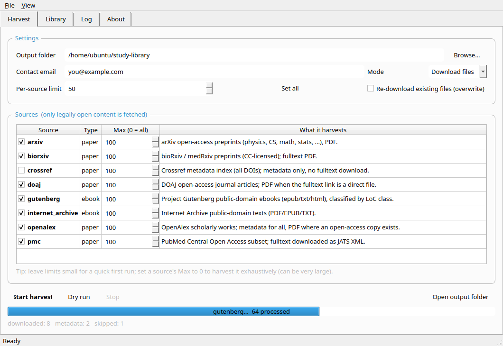
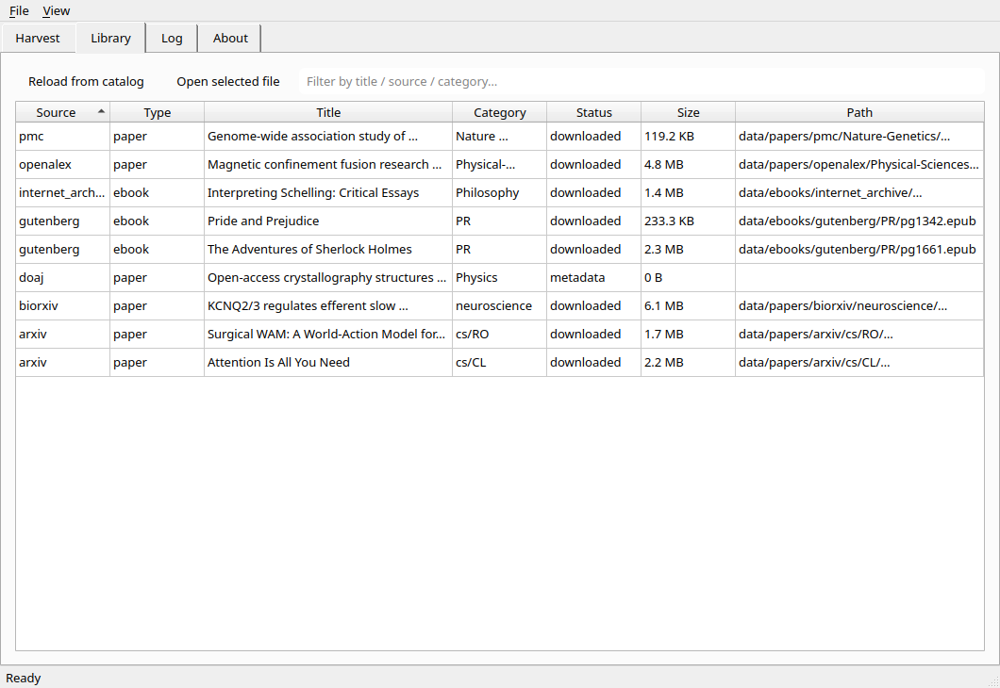
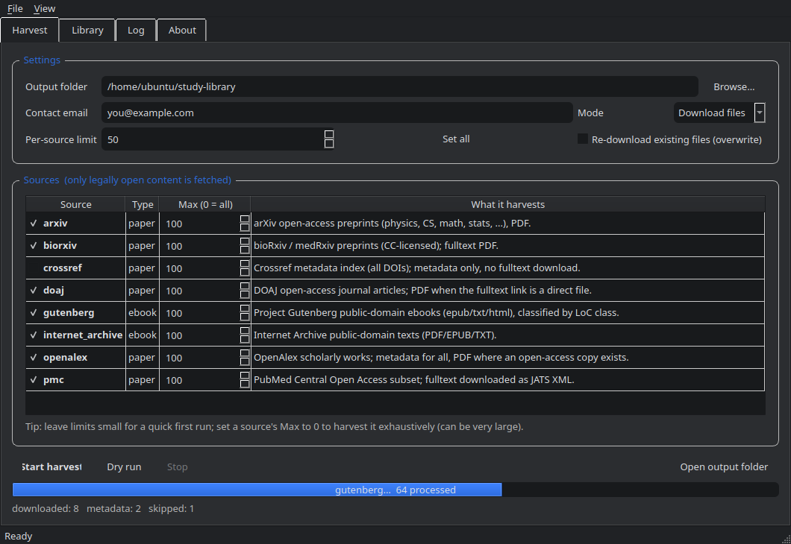
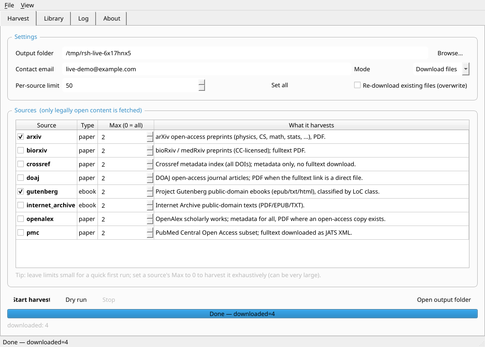
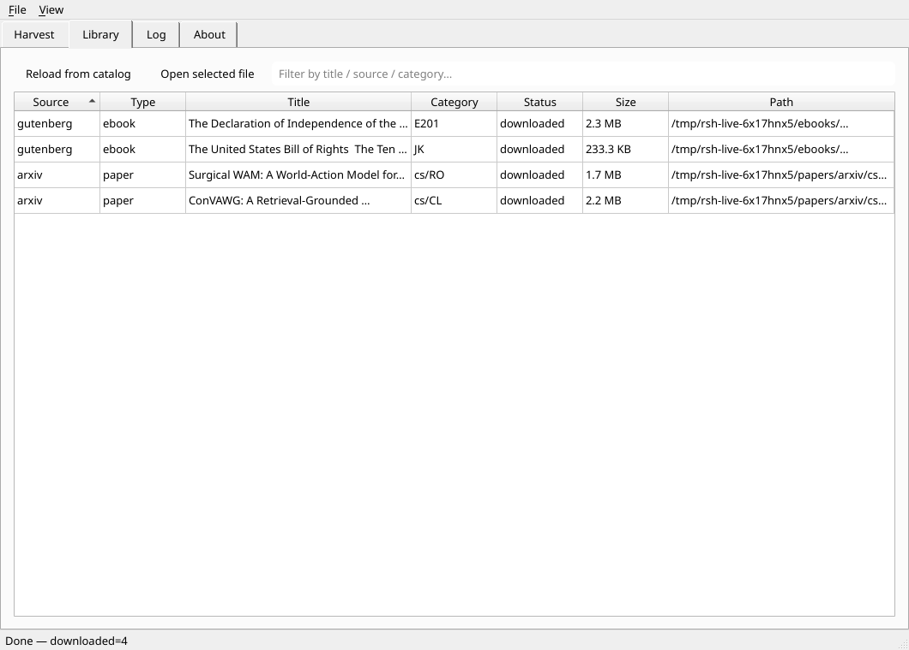

# resource--study

A categorized bulk downloader for **legally open** study resources: open-access
scholarly papers and public-domain / freely-licensed ebooks. Point it at one or
more sources, and it harvests metadata and (where the license allows) the actual
files into a clean, classified directory tree, with a resumable catalog.

> **Scope, honestly stated.** There is no legal way to download "every paper and
> ebook in the world." The overwhelming majority of academic papers sit behind
> publisher paywalls, and most modern books are under copyright. Bulk-scraping
> that material violates terms of service and copyright law. This tool therefore
> harvests only content that is **explicitly free to download**: open-access
> articles, preprints, and public-domain / openly-licensed books. Paywalled or
> access-restricted material is never fetched.

## What you get

- **8 source connectors** spanning papers and ebooks (see the table below).
- **Classification on disk**: files are laid out as
  `data/<papers|ebooks>/<source>/<category…>/<id>.<ext>`, where the category
  comes from each source's own taxonomy (arXiv categories, OpenAlex topic
  hierarchy, Library of Congress classes for Gutenberg, subjects for the rest).
- **A catalog**: one JSON-Lines file per source under `data/catalog/`, with full
  metadata, license, source URL, local path, byte size and SHA-256 per item.
- **Resumable, polite harvesting**: a SQLite state store skips already-fetched
  items across runs; per-source rate limiting and a contact User-Agent respect
  each API's etiquette; downloads stream to disk atomically with retries and
  format fallback.
- **The git repo holds only the tooling.** Everything downloaded (files, catalog,
  state, caches) is written under `data/`, which is git-ignored. A git repo is
  the wrong place for gigabytes of PDFs; keep the harvest on disk or external
  storage and keep the code in version control.

## Sources

| Connector          | Type  | What it harvests | Files downloaded |
| ------------------ | ----- | ---------------- | ---------------- |
| `arxiv`            | paper | arXiv open-access preprints, swept across the full category taxonomy | PDF |
| `openalex`         | paper | OpenAlex works (metadata for everything) | PDF when an open-access copy exists |
| `doaj`             | paper | Directory of Open Access Journals articles | PDF when the fulltext link is a direct file (otherwise metadata) |
| `pmc`              | paper | PubMed Central Open Access subset | Fulltext JATS XML (via E-utilities) |
| `biorxiv`          | paper | bioRxiv / medRxiv preprints (CC-licensed) | PDF |
| `crossref`         | paper | Crossref metadata index (all DOIs) | none — metadata only |
| `gutenberg`        | ebook | Project Gutenberg public-domain books | EPUB / TXT / HTML |
| `internet_archive` | ebook | Internet Archive public-domain texts | PDF / EPUB / TXT |

Run `harvester list-sources` to see this list from the installed package.

## Two ways to use it

- **Desktop app (GUI)** — a clean PySide6 window with source toggles, live
  progress, a searchable library view, and a log. Best if you want a Windows
  `.exe`. See [Desktop app](#desktop-app-gui) and [Building a Windows .exe](#building-a-windows-exe).
- **Command line** — scriptable, headless, ideal for large/automated runs. See
  [Quick start](#quick-start) and the [CLI reference](#cli-reference).

Both share the same engine, connectors, catalog and on-disk layout.

## Desktop app (GUI)

Run from source:

```bash
pip install -e ".[gui]"     # installs PySide6
harvester-gui               # or: python gui_main.py
```



| Library | Dark theme |
| --- | --- |
|  |  |

The window has four tabs:

- **Harvest** — set the output folder, contact email, and mode (download files vs
  metadata only); tick the sources you want and set a per-source limit
  (`0` = harvest everything from that source); then **Start**, **Dry run**, or
  **Stop**. A progress bar and live counts show what's happening.
- **Library** — a searchable, sortable table of harvested items (populated live,
  and reloadable from the on-disk catalog). Double-click a row to open the file.
- **Log** — the run log.
- **About** — the source list and the legal-scope notes.

A Light/Dark theme toggle lives under the **View** menu.

### Verified running headless (Xvfb)

The GUI was run on a headless Linux machine through a virtual display
(`Xvfb :99`, real `xcb` platform and event loop — not a mock) and completed a
real harvest of 2 arXiv PDFs and 2 Project Gutenberg ebooks. Screenshots from
that live run:





To reproduce on a headless box:

```bash
sudo apt-get install -y xvfb
Xvfb :99 -screen 0 1280x900x24 &
DISPLAY=:99 QT_QPA_PLATFORM=xcb harvester-gui
```

## Install

Requires Python 3.9+.

```bash
python3 -m venv .venv
source .venv/bin/activate
pip install -e .
```

## Quick start

```bash
# 1. Write a starter config you can edit
harvester init-config -o config.yaml

# 2. Preview what a run would fetch (no downloads)
harvester harvest --config config.yaml --max 5 --dry-run

# 3. Harvest a small sample from every enabled source
harvester harvest --config config.yaml --max 5 --contact you@example.com

# 4. Inspect what you have
harvester stats -o data
```

Output lands under `data/`:

```
data/
├── papers/
│   ├── arxiv/cs/RO/2608.11204v1.pdf
│   ├── openalex/Physical-Sciences/Physics-and-Astronomy/Nuclear-and-High-Energy-Physics/W3038568908.pdf
│   └── pmc/The-journal-of-gene-medicine/PMC13461269.xml
├── ebooks/
│   ├── gutenberg/PR/pg1342.epub
│   └── internet_archive/History/somebook.pdf
├── catalog/
│   ├── arxiv.jsonl
│   └── … (one per source)
└── harvest.db          # resumable state (SQLite)
```

Each catalog line is a complete record, e.g. (abbreviated):

```json
{"source": "arxiv", "ext_id": "2608.11204v1", "resource_type": "paper",
 "title": "Surgical WAM: A World-Action Model …", "authors": ["Wenrui Bao", "…"],
 "categories": ["cs", "RO"], "license": "arXiv (author license …)",
 "download_url": "https://arxiv.org/pdf/2608.11204v1",
 "local_path": "data/papers/arxiv/cs/RO/2608.11204v1.pdf",
 "sha256": "ca3d4b05…", "bytes": 1821207, "status": "downloaded"}
```

## Configuration

`config.example.yaml` is the reference; copy it to `config.yaml` and edit. Key
ideas:

- `max_records: 0` means **unlimited** for that source. Non-zero is a safety cap.
  The defaults are small so a first run finishes quickly.
- `download: false` (global or per-source) does a **metadata-only** harvest.
- `overwrite: false` (the default) makes runs resumable — existing files and
  already-recorded items are skipped.
- `contact_email` is sent in the User-Agent and to APIs with a "polite pool"
  (OpenAlex, Crossref). Use a real address.
- Each source takes its own options (categories, query, date range, formats,
  languages, rate limit). See the comments in `config.example.yaml`.

### Scaling toward "download everything (that's legal)"

Raise the caps. To harvest a source exhaustively, set its `max_records: 0` (or
`global_max_records: 0` plus per-source `0`). Practical notes:

- This can be **very large and slow**. arXiv alone is ~2.4M PDFs; Project
  Gutenberg is ~70k books; OpenAlex indexes 250M+ works. Plan for terabytes and
  long runtimes, and keep `data/` on a big disk, not in git.
- Runs are resumable: stop and restart freely; the state DB avoids re-downloading.
- Respect the sources. Keep the rate limits reasonable and set a real
  `contact_email`. Some hosts throttle or block bulk direct-download from
  datacenter IPs (a few items may come back as `failed`); the harvester records
  those and moves on.

## CLI reference

```
harvester list-sources                 # list connectors
harvester init-config -o config.yaml   # write starter config
harvester harvest --config config.yaml [options]
harvester stats -o data                # totals from the state DB + catalog

harvest options:
  --only arxiv,gutenberg   restrict to a subset of sources
  --max N                  override every source's cap (0 = unlimited)
  --output DIR             override output directory
  --contact EMAIL          override contact email
  --no-download            metadata only
  --dry-run                preview without downloading
  --quiet                  no progress bars
```

## How classification works

- **arXiv** — the paper's primary category, split into a tree (`cs.RO` → `cs/RO`).
- **OpenAlex** — the `primary_topic` hierarchy (`domain / field / subfield`).
- **DOAJ / Crossref** — subject terms (LCC / Crossref subjects).
- **PMC** — journal name.
- **bioRxiv / medRxiv** — the preprint's subject category.
- **Gutenberg** — Library of Congress class (falls back to bookshelf, then subject).
- **Internet Archive** — the item's first subject.

Anything without a usable category lands under `uncategorized/`.

## Extending

Add a file under `src/harvester/connectors/`, subclass `BaseConnector`, set
`name`/`resource_type`/`description`, implement `iter_records()` to yield
`Record` objects (set `download_url` + `file_ext` for downloadable items, and an
`extra["alt_downloads"]` list of `(url, ext)` fallbacks if you like), and
decorate the class with `@register`. Import it in
`src/harvester/connectors/__init__.py`. It then works everywhere, including the
config and CLI.

## Building a Windows .exe

PyInstaller does **not** cross-compile, so a Windows executable must be built on
Windows. There are two supported paths:

### Option A — GitHub Actions (recommended, no local Windows needed)

`.github/workflows/build-windows.yml` builds the app on a `windows-latest`
runner and uploads two artifacts on every push (and via **Actions → Build
Windows EXE → Run workflow**):

- **`ResourceStudyHarvester-windows-onefile`** — a single `ResourceStudyHarvester.exe`.
- **`ResourceStudyHarvester-windows-onedir`** — a one-folder build (zipped): the
  exe plus its libraries. Starts faster and tends to trip antivirus less often.

### Option B — build locally on Windows

From the repo root on a Windows machine with Python 3.9+ installed:

```bat
packaging\build_windows.bat
```

or manually:

```bat
python -m pip install .[build]
pyinstaller --noconfirm --clean packaging\harvester_gui.spec        REM one-file
set RSH_ONEDIR=1 && pyinstaller --noconfirm --clean packaging\harvester_gui.spec   REM one-folder
```

The one-file executable is written to `dist\ResourceStudyHarvester.exe`; the
one-folder build to `dist\ResourceStudyHarvester\`. Both bundle Python, Qt and
all dependencies, so they run on a clean Windows machine with no Python
installed.

Notes:

- The one-file exe is ~70 MB (mostly Qt). The one-folder build starts faster
  because it does not unpack to a temp dir on every launch.
- Windows SmartScreen / antivirus may warn about an unsigned one-file
  executable; this is a known PyInstaller trade-off. Code-signing, or the
  one-folder build, reduces false positives.
- The app icon is generated by `python tools/make_icon.py`
  (`packaging/icon.ico` for the exe, `src/harvester/resources/icon.png` for the
  window). The same spec produces a native binary on macOS/Linux too.

## Testing

```bash
pip install -e ".[dev,gui]"
pytest -m "not live"                       # offline unit + GUI-smoke tests
QT_QPA_PLATFORM=offscreen pytest -m "not live"   # if no display is available
pytest -m live                             # opt-in tests that hit real endpoints
```

GUI smoke tests are skipped automatically when PySide6 or a usable Qt platform
is unavailable.

## Not included, and why

- **Sci-Hub / Library Genesis / shadow libraries** — distribute copyrighted works
  without permission. Out of scope by design.
- **Standard Ebooks bulk OPDS** — the complete feed now requires a Patrons Circle
  login, so it isn't harvestable anonymously. Its books are otherwise free.
- **Publisher full text behind paywalls** — not downloadable legally in bulk.
  Where OpenAlex/DOAJ/Crossref only expose a paywalled or landing link, the item
  is recorded as metadata rather than downloaded.

## License

MIT (see `pyproject.toml`). Downloaded content keeps its own license, recorded in
the catalog — review it before redistributing.
